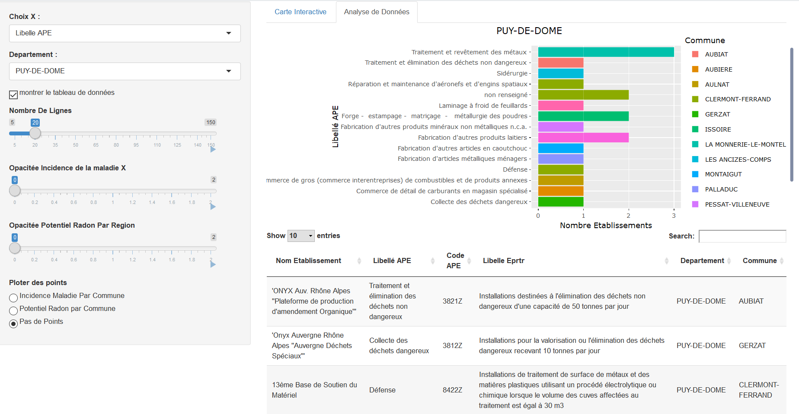

```{r imports, message=FALSE, warning=FALSE, include=FALSE}
library(data.table)
library(spdep)
library(sp)
library(stringr)
library(rgdal)
library(DCluster)
library(epitools)
library(sf)
library(leaflet)
library(dplyr)
library(stats)
library(tidyverse)
library(geojsonio)
library(shape)
library(shiny)
library(ggplot2)
library(plotly)
library(DT)
library(shinydashboard)
library(shinythemes)
library(graphics)
library(knitr)
library(kableExtra)
tableau <- function(df) {
  df <- as.data.frame(df)
  df <- format(df, width = NULL, justify = "centre", big.mark = " ")
  kable(df, format = "html") %>% 
    kable_styling(bootstrap_options = c("striped", "hover"), full_width = F,
                  font_size = 11, position = "left")
}

```

```{r setup, include=FALSE}
knitr::opts_chunk$set(echo = FALSE)
```

##Introduction
Construire un mini-entrepôt de données environnementales au format i2b2

## Description des données :

```{r polluantParEtablissement, echo=FALSE, message=FALSE, warning=FALSE}
polluants <- read_delim("data/etablissement.csv" , "," , escape_double = FALSE , trim_ws = TRUE)

summary(polluants)
knitr::opts_chunk$set(echo = TRUE)
```
**Liste des Etablissements polluants selon GeoRisque**

## localisation etablissement

```{r localisationParEtablissement, echo=FALSE, message=FALSE, warning=FALSE}
localisationParEtablissement <- read_delim("data/registre-francais-des-emission-polluantes-etablissements.csv" , ";" , escape_double = FALSE , trim_ws = TRUE)

summary(localisationParEtablissement)
knitr::opts_chunk$set(echo = TRUE)
```
**Liste des Etablissements avec leur localisation**

## potentiel Radon

```{r radon, echo=FALSE, message=FALSE, warning=FALSE}
radon <- read_delim("data/radon.csv" , ";" , escape_double = FALSE , trim_ws = TRUE)
summary(radon)
knitr::opts_chunk$set(echo = TRUE)
```
**Potentiel Radon**

## Schema Etoile 
```{r schema, echo=FALSE, fig.cap="Schema Etoile", fig.height=6, fig.width=6}
knitr::include_graphics("schema_etoile.png")
```
** Schema Etoile **

## Tables Construites

```{r EtablissementRadon, fig.height=6, fig.width=10, include=FALSE}
EtablissementsPolluants <- polluants %>% dplyr::select( nom ) %>% 
  setnames(old=c("nom"), new=c("Nom Etablissement")) %>% 
  merge(localisationParEtablissement,by="Nom Etablissement")
EtablissementsPolluants <-  setDT(EtablissementsPolluants)[, paste0("type", 1:2) := tstrsplit(coordonnees, ",", type.convert = TRUE, fixed = TRUE)] %>% 
  setnames(old=c("type1","type2"), new=c("lng","lat"))
EtablissementsPolluants <- EtablissementsPolluants %>% filter(!is.na(EtablissementsPolluants$lat)) 
colnames(EtablissementsPolluants)[12] <- "Libelle_APE"
colnames(EtablissementsPolluants)[1] <- "Nom_etablissement"
colnames(EtablissementsPolluants)[3] <- "Num_Siret"
colnames(EtablissementsPolluants)[11] <- "CODE_APE"
colnames(EtablissementsPolluants)[13] <- "CODE_Eprtr"
tableau(EtablissementsPolluants[1:10,])
EtablissementsPolluants$Departement <- gsub("[[:punct:]]", "", as.character(EtablissementsPolluants$Departement))
radon$nom_dept <-  gsub("[[:punct:]]", "", as.character(radon$nom_dept))
EtablissementsPolluants$Departement <- tolower(EtablissementsPolluants$Departement)
radon$nom_dept <- tolower(radon$nom_dept)
EtablissementsPolluants <- EtablissementsPolluants %>% filter(!is.na(Departement))%>% group_by(Departement)
radon <- radon %>% filter(!is.na(nom_dept)) %>% group_by(nom_dept)
EtablissementsPolluants$Commune <- gsub("[[:punct:]]", "", as.character(EtablissementsPolluants$Commune))
radon$nom_comm <-  gsub("[[:punct:]]", "", as.character(radon$nom_comm))
EtablissementsPolluants$Commune <- tolower(EtablissementsPolluants$Commune)
radon$nom_comm <- tolower(radon$nom_comm)
EtablissementsPolluants <- EtablissementsPolluants %>% filter(!is.na(Commune))%>% group_by(Commune)
radon <- radon %>% filter(!is.na(nom_comm)) %>% group_by(nom_comm)
EtablissementRadon <- merge(radon,EtablissementsPolluants,by.x=c("nom_comm","nom_dept"),by.y=c("Commune","Departement"),all.x=F,all.y=T)
EtablissementRadon <- EtablissementRadon %>% dplyr::filter(!is.na(EtablissementRadon$lng))
```


```{r summary, echo=FALSE}
summary(EtablissementRadon)

```
** Entrepot de données **

## Carte Interactives
```{r SpatialPointDataFrama, fig.align="center", fig.height=7, fig.width=8, message=FALSE, warning=FALSE, include=FALSE}

coordinates(EtablissementRadon) <- ~ lng + lat
EtablissementRadon@coords <- EtablissementRadon@coords[,c(2,1)]
knitr::opts_chunk$set(echo = TRUE)
effectif_france <- read_delim("data/effectif.france.csv", ";", escape_double = FALSE, trim_ws = TRUE)
evenements <- read_delim("data/evenements.csv", ";", escape_double = FALSE, trim_ws = TRUE)
effectif_departement <- read_delim("data/effectif.departement.csv", ";", escape_double = FALSE, trim_ws = TRUE)
ratio.vector <- vector()
for (i in colnames(evenements[,-1])) {
  ratio.vector <- append(ratio.vector, round(ageadjust.direct(count = evenements[,i], 
                                                              pop = effectif_departement[,i], 
                                                              stdpop = effectif_france[,2])["adj.rate"] *10^5, 2))
}
ratioEvenement <- tibble(dep = colnames(evenements[,-1]),
                          
                          ratio = ratio.vector )
ratioEvenement$dep <- gsub("[[:punct:]]", "", as.character(ratioEvenement$dep))
ratioEvenement$dep <- tolower(ratioEvenement$dep )
radon <- radon %>% group_by(nom_dept)
ratioRadon <- left_join(ratioEvenement,radon,by=c("dep"="nom_dept"),all.x=T,all.y=F)
rm(effectif_france)
rm(evenements)
rm(effectif_departement)
departements <- geojsonio::geojson_read("data/departements.geojson", what = "sp")
departements$nom <- gsub("[[:punct:]]", "", as.character(departements$nom ))
departements$nom <- tolower(departements$nom )
departements@data = data.frame(departements@data, ratioEvenement[match(departements@data$nom, ratioEvenement$dep),])
departements@data = data.frame(departements@data, radon[match(departements@data$nom, radon$nom_dept),])

EtablissementRadon@data= data.frame(EtablissementRadon@data, ratioRadon[match(EtablissementRadon@data$classe_potentiel, ratioRadon$classe_potentiel),])
EtablissementsPolluants$Departement <- toupper(EtablissementsPolluants$Departement)
EtablissementsPolluants$Commune <- toupper(EtablissementsPolluants$Commune)
knitr::opts_chunk$set(echo = TRUE)
```

## Carte  Maladie

```{r carteMaladieDepartement, echo=FALSE, fig.align="center", fig.height=6, fig.width=8}
bins2 <- c(0,1, 2,3,4,5,6,7,8,Inf)
pal2 <- colorBin("Blues", domain = departements$ratio, bins = bins2)


carteMaladieDepartement  <- leaflet(departements) %>%  addProviderTiles(providers$Esri.WorldStreetMap) %>% 
  setView(lat = 47.256, lng = 2.35, zoom = 6) %>% 
  addPolygons( fillColor = ~pal2(ratio),
               weight = 2,
               opacity = 1,
               color = "white",
               dashArray = "3",
               fillOpacity = 0.7)           %>% addLegend(pal = pal2, 
                                                          values = ~ratio, 
                                                          opacity = 0.7, 
                                                          title = "Ratio incidence maladie X",
                                                          position = "bottomright")
carteMaladieDepartement

knitr::opts_chunk$set(echo = TRUE)
```
**Carte 1**Incidence Maladie par Departement

## Carte Potentiel Radon

```{r carteRadonDepartement, echo=FALSE, fig.align="center", fig.height=6, fig.width=8}
pal <-colorFactor(c("gray","yellow","red"), domain = c(1,2,3) , na.color ="white" , alpha = TRUE )

carteRadonDepartement <- leaflet(departements) %>%  addProviderTiles(providers$Esri.WorldStreetMap) %>% 
  setView(lat = 47.256, lng = 2.35, zoom = 6) %>% 
  addPolygons( fillColor = ~pal(classe_potentiel),
                       weight = 2,
                       opacity = 1,
                       color = "white",
                       dashArray = "3",
                       fillOpacity = 0.7)           %>% addLegend(pal = pal, 
                                                                  values = ~classe_potentiel, 
                                                                  opacity = 0.7, 
                                                                  title = "Potentiel Radon",
                                                                  position = "topright") 
carteRadonDepartement 
knitr::opts_chunk$set(echo = TRUE)
```
**Carte 2**Potentiel Radon par Departement


## Carte Etablissements

```{r carteEtablissements, echo=FALSE, fig.align="center", fig.height=6, fig.width=8}
col <- colorFactor(c("gray","yellow","red"), domain = c(1,2,3) , na.color ="white" , alpha = TRUE )
carteEtablissements <- leaflet(departements) %>%
  addProviderTiles(providers$Esri.WorldStreetMap) %>%setView(lat = 47.256, lng = 2.35, zoom = 6) %>% 
  addMarkers(data = EtablissementRadon@coords, 
             clusterOptions = markerClusterOptions() ,
             label = EtablissementRadon@data$Nom_etablissement ,
             popup = str_c("<br/>Commune :<br/>",EtablissementRadon@data$nom_comm ,"<br/> num siret :<br/> " , 
                           EtablissementRadon@data$Num_Siret, "<br/> APE : <br/>" , 
                           EtablissementRadon@data$Libelle_APE  ) ) 
carteEtablissements
knitr::opts_chunk$set(echo = TRUE)
```
**Carte 3**Etablissement Polluants

## Analyses de données

```{r Histogramme, echo=FALSE, fig.cap="Histogramme d'analyse", out.width='100%'}
histDepartement <- function(EtablissementsPolluants, choice,ligne) {
  plot <- EtablissementsPolluants %>% filter(Departement == choice) %>%  group_by(Libelle_APE) %>% filter(!is.na(Libelle_APE))
  plot2 <- plot[1:ligne,]
  p <-  ggplot(data = plot2 , aes (x=plot2$Libelle_APE,y=length(Nom_etablissement)/ligne)) + 
    geom_bar(aes(fill=Commune), stat="identity" , position = position_stack(reverse = TRUE)) + coord_flip() +
    theme(legend.position = "bottom") + 
    xlab("Libellé APE") + ylab("Nombre Etablissements ") + ggtitle(choice) 
  ggplotly(p ) 
}
histDepartementNom <- function(EtablissementsPolluants, choice,ligne) {
  plot <- EtablissementsPolluants %>% filter(Departement == choice) %>%  group_by(Nom_etablissement) %>% filter(!is.na(Nom_etablissement))
  plot2 <- plot[1:ligne,]
  p <-  ggplot(data = plot2 , aes (x=plot2$Nom_etablissement,y=length(Nom_etablissement)/ligne)) + 
    geom_bar(aes(fill=Commune), stat="identity" , position = position_stack(reverse = TRUE)) + coord_flip() +
    theme(legend.position = "bottom") + 
    xlab("Nom Etablissement") + ylab("Nombre Etablissements ") + ggtitle(choice) 
  ggplotly(p ) 
}

histDepartementCodeEprtr <- function(EtablissementsPolluants, choice,ligne) {
  plot <- EtablissementsPolluants %>% filter(Departement == choice) %>%  group_by(CODE_Eprtr) %>% filter(!is.na(CODE_Eprtr))
  plot2 <- plot[1:ligne,]
  p <-  ggplot(data = plot2 , aes (x=plot2$CODE_Eprtr,y=length(Nom_etablissement)/ligne)) + 
    geom_bar(aes(fill=Commune), stat="identity" , position = position_stack(reverse = TRUE)) + coord_flip() +
    theme(legend.position = "bottom") + 
    xlab("Code Eprtr ") + ylab("Nombre Etablissements ") + ggtitle(choice) 
  ggplotly(p ) 
}



```
**Analyses de données**


##
```{r shiny, echo=FALSE, fig.align="center"}
shinyApp(
  ui <- fluidPage(
    theme = shinytheme("slate"),
    sidebarPanel(
      selectInput("axis","Choix X :" , choices = c("Libelle APE","Nom Etablissement","Code Eprtr"),selected = "Libelle APE"),
      selectInput("Departement",  "Departement :",
                  choices = EtablissementsPolluants$Departement , selected = ""),
      checkboxInput("table","montrer le tableau de données",value = FALSE),
      sliderInput(inputId ="size", label="Nombre De Lignes", value = 15,
                  min = 5, max = 150, step = 5, animate =T , width = '400px' ),
      sliderInput(inputId ="opacity", label="Opacitée Incidence de la maladie X", value = 0,
                  min = 0, max = 2, step = 0.5, animate =T , width = '400px' ),
      sliderInput(inputId ="opacityRadon", label="Opacitée Potentiel Radon Par Region", value = 0,
                  min = 0, max = 2, step = 0.5, animate =T , width = '400px' ),
      radioButtons(inputId="points", label="Ploter des points",
                   choices = c("Incidence Maladie Par Commune",
                               "Potentiel Radon par Commune",
                               "Pas de Points"), 
                   selected = "Pas de Points",
                   width = "400px" )
      
      
     ),
    
    mainPanel(
      tabsetPanel(
        tabPanel("Carte Interactive",box( leafletOutput("map", width = "100%", height = "700px"),title = "Carte Interavtive pour les EtablissementsPolluants,PotentielRadon,IncidenceMaladieX",width = "100%", height = "100%")),
        tabPanel("Analyse de Donnees",plotlyOutput("Plot"), 
                 DT::dataTableOutput("tableau"))
        ))),
  
  
  server <- function(input, output) {
    output$tableau <- DT::renderDataTable({
    if (input$table){
      DT::datatable(data = EtablissementsPolluants %>% filter(Departement == input$Departement)  %>% dplyr::select(Nom_etablissement,
                                                                                                  Libelle_APE,
                                                                                                  CODE_APE ,
                                                                                                  `Libelle Eprtr`,Departement,Commune),
                    options = list(pageLength=10),rownames = F)
    }})
    
    output$Plot  <- renderPlotly({  if(input$axis=="Libelle APE"){
      histDepartement(EtablissementsPolluants,input$Departement,input$size)}
      else if (input$axis=="Nom Etablissement"){ histDepartementNom(EtablissementsPolluants,input$Departement,input$size)}
      else if (input$axis=="Code Eprtr"){histDepartementCodeEprtr(EtablissementsPolluants,input$Departement,input$size)
      }})
   
   
    output$map <- renderLeaflet({
if(input$points=="Incidence Maladie Par Commune"){
  
carteEtablissements %>% 
    addPolygons( fillColor = ~pal2(ratio),
                 weight = 2,
                 opacity = 1,
                 color = "white",
                 dashArray = "3",
                 fillOpacity = input$opacity)%>% addLegend(pal = pal2, 
                                                           values = ~ratio, 
                                                           opacity = 0.7, 
                                                           title = "Ratio incidence maladie X",
                                                           position = "bottomright") %>% 
    addPolygons( fillColor = ~pal(classe_potentiel),
                 weight = 2,
                 opacity = 1,
                 color = "White",
                 dashArray = "3",
                 fillOpacity = input$opacityRadon) %>% 
    addLegend(pal = pal, 
              values = ~classe_potentiel, 
              opacity = 0.7, 
              title = "Potentiel Radon",
              position = "topright")   %>%  
addCircles(data = EtablissementRadon@coords, 
                 color= pal2(EtablissementRadon$ratio) ,
                 label = EtablissementRadon$nom_dept,
                  popup = str_c("<br/>Ratio :<br/>",EtablissementRadon@data$ratio,
                                                  "<br/>Commune :<br/>",EtablissementRadon@data$nom_comm ) )
}
else if(input$points=="Potentiel Radon par Commune"){
  carteEtablissements %>%     addPolygons( fillColor = ~pal2(ratio),
                 weight = 2,
                 opacity = 1,
                 color = "white",
                 dashArray = "3",
                 fillOpacity = input$opacity)%>% addLegend(pal = pal2, 
                                                           values = ~ratio, 
                                                           opacity = 0.7, 
                                                           title = "Ratio incidence maladie X",
                                                           position = "bottomright") %>% 
    addPolygons( fillColor = ~pal(classe_potentiel),
                 weight = 2,
                 opacity = 1,
                 color = "White",
                 dashArray = "3",
                 fillOpacity = input$opacityRadon)   %>% 
    addLegend(pal = pal, 
              values = ~classe_potentiel, 
              opacity = 0.7, 
              title = "Potentiel Radon",
              position = "topright")   %>%  
    addCircles(data = EtablissementRadon@coords, 
                     color= pal(EtablissementRadon@data$classe_potentiel) ,
                     label = EtablissementRadon$nom_dept,
                     popup = str_c("<br/>Ratio :<br/>",EtablissementRadon@data$classe_potentiel,
                                   "<br/>Commune :<br/>",EtablissementRadon@data$nom_comm ) )
}
else if(input$points=="Pas de Points"){carteEtablissements %>% 
    addPolygons( fillColor = ~pal2(ratio),
                 weight = 2,
                 opacity = 1,
                 color = "white",
                 dashArray = "3",
                 fillOpacity = input$opacity)%>% addLegend(pal = pal2, 
                                                           values = ~ratio, 
                                                           opacity = input$opacity, 
                                                           title = "Ratio incidence maladie X",
                                                           position = "bottomright") %>% 
    addPolygons( fillColor = ~pal(classe_potentiel),
                 weight = 2,
                 opacity = 1,
                 color = "White",
                 dashArray = "3",
                 fillOpacity = input$opacityRadon) %>% 
    addLegend(pal = pal, 
              values = ~classe_potentiel, 
              opacity = 0.6, 
              title = "Potentiel Radon",
              position = "topright")  
    
    
}
      

      
    })
  },
options = list(width = "1400", height = "800")
)

```

## Test d'autocorrelation Spatial


```{r AutocorrelationSpatiale, message=FALSE, warning=FALSE, include=FALSE, paged.print=FALSE}
departements@data$ratio <- replace(departements@data$ratio, is.na(departements@data$ratio), 0) 
#Voisinage pour autocorrelation
voisinQ=poly2nb(departements)
voisinR=poly2nb(departements,	queen=FALSE)		
coords = coordinates(departements)
#Matrice conguite
matrice_conguiteQ = nb2listw(voisinQ,zero.policy=TRUE)	
#Bootstrap
bootstrap=moran.mc(departements$ratio,listw=matrice_conguiteQ,	nsim=999)		
#autocorrelogram
cor=sp.correlogram(voisinQ,	departements$ratio,	order=8,	method="I",	style="W",zero.policy=TRUE )	
#stone
Coordonees <-  EtablissementsPolluants %>% dplyr::select(Departement,lng,lat)
doublons <- which(duplicated(Coordonees$Departement)) 
Coordonees<-Coordonees[-doublons,]
Coordonees$Departement <- gsub("[[:punct:]]", "", as.character(Coordonees$Departement))
Coordonees$Departement <- tolower(Coordonees$Departement)
stoneTest <- merge(ratioEvenement,Coordonees,by.x="dep" ,by.y="Departement")
ratioRadon <- ratioRadon %>% select(dep,ratio,classe_potentiel)
colnames(stoneTest) <- c("dep","Observed","commune","x","y")
stoneTest <-  left_join(stoneTest,ratioRadon)
stoneTest <- stoneTest %>% filter(!is.na(stoneTest$ratio))
stoneTest <- stoneTest %>% filter(!is.na(stoneTest$classe_potentiel))
stoneTest<-cbind(stoneTest, Expected=stoneTest$classe_potentiel*stoneTest$ratio/stoneTest$classe_potentiel)
stoneTest <- stoneTest %>% dplyr::select(dep,Observed,Expected,x,y)

```

## Voisinage de type QUEEN :

```{r voisinage,echo=FALSE}

plot(departements)	
plot(voisinQ,	coords,	add=T,	col=2)	
legend("bottom",c("queen"),	
       text.col=c(2,3))	
```
**Voisinage de type QUEEN **

## Test de Morane 

```{r matriceConguite, echo=FALSE, message=FALSE}
moran.test(ratioEvenement$ratio,	listw=matrice_conguiteQ,	alternative="two.sided",	randomisation=FALSE)	
```
**Test de Morane**

## Histogramme du Bootstrap

```{r moran,echo=FALSE}

hist(bootstrap$res, freq=TRUE,breaks=20, xlab="Simulated Moran's I")
abline(v=0, col='red')

```
**Histogramme de Bootstrap**

## Tests de geary

```{r gary,echo=FALSE}
geary.test(ratioEvenement$ratio,	listw=matrice_conguiteQ,	alternative="two.sided")

```
**Test de Geary**

## Autocorrelogramme

```{r autocorrelograme, echo=FALSE, fig.height=5, fig.width=8, message=TRUE, warning=TRUE, paged.print=FALSE}
plot(cor)
```
**Autocorrelogramme**

## Test de Stone :
Exemple pour Paris

```{r stone, echo=FALSE, fig.height=5, fig.width=8, message=TRUE, warning=TRUE, paged.print=FALSE}
stone.test(Observed~offset(log(Expected)), stoneTest, model="poisson", R=99,region="paris", lambda=1)
```
**Test de Stone**


## Merci
Merci de votre Attention

