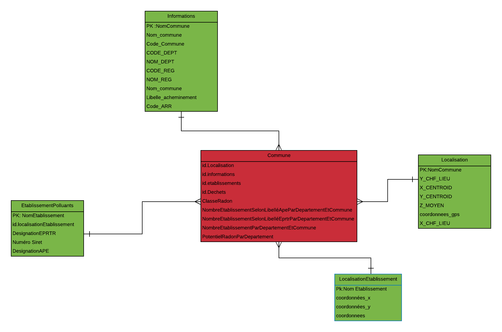

```{r imports, echo=FALSE, message=FALSE}
library(data.table)
library(spdep)
library(sp)
library(stringr)
library(rgdal)
library(DCluster)
library(epitools)
library(sf)
library(leaflet)
library(dplyr)
library(stats)
library(tidyverse)
library(geojsonio)
library(shape)
library(shiny)
library(ggplot2)
library(plotly)
library(DT)
library(shinydashboard)
library(shinythemes)
library(graphics)
library(knitr)
library(kableExtra)
tableau <- function(df) {
  df <- as.data.frame(df)
  df <- format(df, width = NULL, justify = "centre", big.mark = " ")
  kable(df, format = "html") %>% 
    kable_styling(bootstrap_options = c("striped", "hover"), full_width = F,
                  font_size = 11, position = "left")
}

```


#Introduction:
La fouille de données (data mining) permet de faire un lien entre les statistiques et les technologies de l’information (base de données, intelligence artificielle, apprentissage automatique (machine learning), utilisée pour la recherche d’informations dans les grandes bases de données médicales ou de santé.
Les outils de collecte automatique des données et bases de données permettent de stocker dans des entrepôts d’énormes masses de données. La fouille de données et les entrepôts permettent l’extraction de connaissances.  
L’utilisation de ces masses de données, issues de structures médicales, peut permettre d’acquérir de nouvelles connaissances via différents types d’études. Notamment avec le logiciel R.

Dans ce projet on est amenées à Construire un mini-entrepôt de données environnementales au format i2b2
Construire une application shiny pour explorer notre entrepôt de données
Analysez la corrélation entre exposition environnementales et répartition des patients atteints de la maladie X par des méthodes de statistiques spatiales.


#Description des données
Pour l'aboutissement de notre projet nous avons choisis deux jeux de données :
-polluants par établissements avec localisation établissements qui se compose de 9572 observations et 6 variables et 14954 observations et 15 variables provenant du site :
https://public.opendatasoft.com/explore/dataset/registre-francais-des-emission-polluantes-etablissements/table/
-Radon se compose de 36104 observations et 5 variables et provient du site :
https://www.data.gouv.fr/fr/datasets/connaitre-le-potentiel-radon-de-ma-commune/

Le registre des rejets et des transferts de polluants (RRTP) est un inventaire national des substances chimiques et/ou des polluants potentiellement dangereux rejetés dans l'air, l'eau et le sol de la production et du traitement des déchets dangereux et non dangereux 
Les attributs de cette base sont :

```{r polluantParEtablissement,echo=FALSE}
polluants <- read_delim("data/etablissement.csv" , "," , escape_double = FALSE , trim_ws = TRUE)

summary(polluants)
knitr::opts_chunk$set(echo = TRUE)
```
**Liste des Etablissements polluants selon GeoRisque**
```{r localisationParEtablissement, echo=TRUE}
localisationParEtablissement <- read_delim("data/registre-francais-des-emission-polluantes-etablissements.csv" , ";" , escape_double = FALSE , trim_ws = TRUE)

summary(localisationParEtablissement)
knitr::opts_chunk$set(echo = TRUE)
```
**Liste des Etablissements avec leur localisation**
Le radon qui est un gaz radioactif produit par la désintégration naturelle de l’uranium présent dans les roches. Cancérigène pulmonaire, il présente un risque pour la santé lorsqu’il s’accumule dans les bâtiments. L’étude de jeux de données nous permet de voir le potentiel radon dans chaque commune, les attributs de cette base de données sont :

```{r radon,echo=FALSE}
radon <- read_delim("data/radon.csv" , ";" , escape_double = FALSE , trim_ws = TRUE)
summary(radon)
knitr::opts_chunk$set(echo = TRUE)
```
**Potentiel Radon**

# Création de l'entrepot de données:
Après avoir choisi les deux jeux de données, bien les analyser et étudier on est passé à l’étape de la construction de notre entrepôt de données à partir des deux jeux donnés 
Et cela au format i2b2 (Informatics for Integrating Biology & the Bedside)
Donc la fouille de données qui consistait à analyser les jeux de données choisit nous a permis d’extraire des connaissances. Regrouper des techniques statistiques et ainsi pouvoir construire notre propre entrepôt de données.
Les données de notre entrepôt au format i2b2 résident est décrite dans le schéma en étoile suivant qui est la structure de données la plus utilisée et la plus appropriée aux requêtes et analyses des utilisateurs d’entrepôts de données

```{r scheme, echo=FALSE, fig.cap="A caption", out.width = '100%',echo=FALSE}


```

Comme le décrit le schéma ci-dessus :
La Table centrale « commune » qui contient les données observables les faits qui sont numérique et d’ordre quantitatif que l’on possède que l’on veut étudier (classe Radon, nombre établissement par département et commune …), selon divers axes d’analyse les dimensions qui sont les tables de dimensions (informations, localisation établissement, localisation, établissement polluant) selon lesquels on veut étudier les données observables (les faits).

 
1-Création de la base de données:
On a créé la table Établissement qui est la jointure entre la table polluant Par Établissement et localisation Par Établissement on change les noms des colonnes pour eviter les problemes d'encodage . on a aussi separé l'attribut coordonnées en deux colonnes : longitude et latitude
```{r Etablissements, echo=TRUE, message=TRUE}

EtablissementsPolluants <- polluants %>% dplyr::select( nom ) %>% 
  setnames(old=c("nom"), new=c("Nom Etablissement")) %>% 
  merge(localisationParEtablissement,by="Nom Etablissement")
EtablissementsPolluants <-  setDT(EtablissementsPolluants)[, paste0("type", 1:2) := tstrsplit(coordonnees, ",", type.convert = TRUE, fixed = TRUE)] %>% 
  setnames(old=c("type1","type2"), new=c("lng","lat"))
EtablissementsPolluants <- EtablissementsPolluants %>% filter(!is.na(EtablissementsPolluants$lat)) 
colnames(EtablissementsPolluants)[12] <- "Libelle_APE"
colnames(EtablissementsPolluants)[1] <- "Nom_etablissement"
colnames(EtablissementsPolluants)[3] <- "Num_Siret"
colnames(EtablissementsPolluants)[11] <- "CODE_APE"
colnames(EtablissementsPolluants)[13] <- "CODE_Eprtr"
tableau(EtablissementsPolluants[1:10,])
```
**Table 1** : Etablissement Polluant ainsi que leur localisation
Ensuite on a fait la jointure de la table crée et la table radon selon le Département et les communes afin d'eviter un maximum les NAs.on a eu besoin d'une normalisation de texte pour garantir les matches entres les attribus 
```{r EtablissementRadon, echo=TRUE}
EtablissementsPolluants$Departement <- gsub("[[:punct:]]", "", as.character(EtablissementsPolluants$Departement))
radon$nom_dept <-  gsub("[[:punct:]]", "", as.character(radon$nom_dept))
EtablissementsPolluants$Departement <- tolower(EtablissementsPolluants$Departement)
radon$nom_dept <- tolower(radon$nom_dept)
EtablissementsPolluants <- EtablissementsPolluants %>% filter(!is.na(Departement))%>% group_by(Departement)
radon <- radon %>% filter(!is.na(nom_dept)) %>% group_by(nom_dept)
EtablissementsPolluants$Commune <- gsub("[[:punct:]]", "", as.character(EtablissementsPolluants$Commune))
radon$nom_comm <-  gsub("[[:punct:]]", "", as.character(radon$nom_comm))
EtablissementsPolluants$Commune <- tolower(EtablissementsPolluants$Commune)
radon$nom_comm <- tolower(radon$nom_comm)
EtablissementsPolluants <- EtablissementsPolluants %>% filter(!is.na(Commune))%>% group_by(Commune)
radon <- radon %>% filter(!is.na(nom_comm)) %>% group_by(nom_comm)
EtablissementRadon <- merge(radon,EtablissementsPolluants,by.x=c("nom_comm","nom_dept"),by.y=c("Commune","Departement"),all.x=F,all.y=T)
EtablissementRadon <- EtablissementRadon %>% dplyr::filter(!is.na(EtablissementRadon$lng))
tableau(EtablissementRadon[1:10,])
```
**Table 2** :Etablissement Polluant avec Potentiel Radon
On a ensuite utilisé cette table pour crée un spatial Points data frame pour modéliser nos points dans la carte 
```{r SpatialPointDataFrama, echo=TRUE}

coordinates(EtablissementRadon) <- ~ lng + lat
EtablissementRadon@coords <- EtablissementRadon@coords[,c(2,1)]
knitr::opts_chunk$set(echo = TRUE)
```
# Conception des cartes de France en fonctions de plusieurs attributs  
Concernant les données geographiques nous avons importé un fichier qu'on trouvé sur GiTHUB qui est un Spatial Polygon Data Frame , afin d'avoir les coordonnées des polygones selon les departements a partir des codes INSEE des communes , nous avons par la suite fait une jointure entre les données geographique et le potentiel radon ainsi que l'incidence de la maladie X [l'incidence est representé par departement (ratioEvenement)nous avons utilisé le code fait en cours pour la creation de la table (afin d'inclure la question 3 dans l'application Shiny )].
```{r SpatialPolygoneDataFrame, include=FALSE}
effectif_france <- read_delim("data/effectif.france.csv", ";", escape_double = FALSE, trim_ws = TRUE)
evenements <- read_delim("data/evenements.csv", ";", escape_double = FALSE, trim_ws = TRUE)
effectif_departement <- read_delim("data/effectif.departement.csv", ";", escape_double = FALSE, trim_ws = TRUE)
ratio.vector <- vector()
for (i in colnames(evenements[,-1])) {
  ratio.vector <- append(ratio.vector, round(ageadjust.direct(count = evenements[,i], 
                                                              pop = effectif_departement[,i], 
                                                              stdpop = effectif_france[,2])["adj.rate"] *10^5, 2))
}
ratioEvenement <- tibble(dep = colnames(evenements[,-1]),
                          
                          ratio = ratio.vector )
ratioEvenement$dep <- gsub("[[:punct:]]", "", as.character(ratioEvenement$dep))
ratioEvenement$dep <- tolower(ratioEvenement$dep )
radon <- radon %>% group_by(nom_dept)
ratioRadon <- left_join(ratioEvenement,radon,by=c("dep"="nom_dept"),all.x=T,all.y=F)
rm(effectif_france)
rm(evenements)
rm(effectif_departement)
```

```{r SpatialPointsDataFrame, echo=TRUE}
departements <- geojsonio::geojson_read("data/departements.geojson", what = "sp")
departements$nom <- gsub("[[:punct:]]", "", as.character(departements$nom ))
departements$nom <- tolower(departements$nom )
departements@data = data.frame(departements@data, ratioEvenement[match(departements@data$nom, ratioEvenement$dep),])
departements@data = data.frame(departements@data, radon[match(departements@data$nom, radon$nom_dept),])

EtablissementRadon@data= data.frame(EtablissementRadon@data, ratioRadon[match(EtablissementRadon@data$classe_potentiel, ratioRadon$classe_potentiel),])
EtablissementsPolluants$Departement <- toupper(EtablissementsPolluants$Departement)
EtablissementsPolluants$Commune <- toupper(EtablissementsPolluants$Commune)
knitr::opts_chunk$set(echo = TRUE)
```
On a réalisé une première carte qui représente le ratio de l'évènement de la maladie X selon les Régions

```{r carteMaladieDepartement ,echo=FALSE }
bins2 <- c(0,1, 2,3,4,5,6,7,8,Inf)
pal2 <- colorBin("Blues", domain = departements$ratio, bins = bins2)


carteMaladieDepartement  <- leaflet(departements) %>%  addProviderTiles(providers$Esri.WorldStreetMap) %>% 
  setView(lat = 47.256, lng = 2.35, zoom = 6) %>% 
  addPolygons( fillColor = ~pal2(ratio),
               weight = 2,
               opacity = 1,
               color = "white",
               dashArray = "3",
               fillOpacity = 0.7)           %>% addLegend(pal = pal2, 
                                                          values = ~ratio, 
                                                          opacity = 0.7, 
                                                          title = "Ratio incidence maladie X",
                                                          position = "bottomright")
carteMaladieDepartement

knitr::opts_chunk$set(echo = TRUE)
```
**Carte 1**Incidence Maladie par Departement
La seconde carte représente le potentiel Radon selon les departements département

```{r carteRadonDepartement, echo=TRUE}
pal <-colorFactor(c("gray","yellow","red"), domain = c(1,2,3) , na.color ="white" , alpha = TRUE )

carteRadonDepartement <- leaflet(departements) %>%  addProviderTiles(providers$Esri.WorldStreetMap) %>% 
  setView(lat = 47.256, lng = 2.35, zoom = 6) %>% 
  addPolygons( fillColor = ~pal(classe_potentiel),
                       weight = 2,
                       opacity = 1,
                       color = "white",
                       dashArray = "3",
                       fillOpacity = 0.7)           %>% addLegend(pal = pal, 
                                                                  values = ~classe_potentiel, 
                                                                  opacity = 0.7, 
                                                                  title = "Potentiel Radon",
                                                                  position = "topright") 
carteRadonDepartement 
knitr::opts_chunk$set(echo = TRUE)
```
**Carte 2**Potentiel Radon par Departement
La troisième carte représente la carte de France par département avec des Marqueurs qui font référence à tous les établissements

```{r carteEtablissements}
col <- colorFactor(c("gray","yellow","red"), domain = c(1,2,3) , na.color ="white" , alpha = TRUE )
carteEtablissements <- leaflet(departements) %>%
  addProviderTiles(providers$Esri.WorldStreetMap) %>%setView(lat = 47.256, lng = 2.35, zoom = 6) %>% 
  addMarkers(data = EtablissementRadon@coords, 
             clusterOptions = markerClusterOptions() ,
             label = EtablissementRadon@data$Nom_etablissement ,
             popup = str_c("<br/>Commune :<br/>",EtablissementRadon@data$nom_comm ,"<br/> num siret :<br/> " , 
                           EtablissementRadon@data$Num_Siret, "<br/> APE : <br/>" , 
                           EtablissementRadon@data$Libelle_APE  ) ) 
carteEtablissements
knitr::opts_chunk$set(echo = TRUE)
```
**Carte 3**Etablissement Polluants

# Réalisation d’histogramme 
Nous avons choisis pour analysé les données de representé un histogramme interactif selon le departement : 
on peux choisir l'axe des X de notre Histogramme selon : Nom etablissement , Libellé APE ou code EPRTR , en y ajoutant sur Shiny un tableau pour bien lire les données
```{r Histogramme, echo=TRUE, fig.cap="A caption", out.width='100%'}
histDepartement <- function(EtablissementsPolluants, choice,ligne) {
  plot <- EtablissementsPolluants %>% filter(Departement == choice) %>%  group_by(Libelle_APE) %>% filter(!is.na(Libelle_APE))
  plot2 <- plot[1:ligne,]
  p <-  ggplot(data = plot2 , aes (x=plot2$Libelle_APE,y=length(Nom_etablissement)/ligne)) + 
    geom_bar(aes(fill=Commune), stat="identity" , position = position_stack(reverse = TRUE)) + coord_flip() +
    theme(legend.position = "bottom") + 
    xlab("Libellé APE") + ylab("Nombre Etablissements ") + ggtitle(choice) 
  ggplotly(p ) 
}
histDepartementNom <- function(EtablissementsPolluants, choice,ligne) {
  plot <- EtablissementsPolluants %>% filter(Departement == choice) %>%  group_by(Nom_etablissement) %>% filter(!is.na(Nom_etablissement))
  plot2 <- plot[1:ligne,]
  p <-  ggplot(data = plot2 , aes (x=plot2$Nom_etablissement,y=length(Nom_etablissement)/ligne)) + 
    geom_bar(aes(fill=Commune), stat="identity" , position = position_stack(reverse = TRUE)) + coord_flip() +
    theme(legend.position = "bottom") + 
    xlab("Nom Etablissement") + ylab("Nombre Etablissements ") + ggtitle(choice) 
  ggplotly(p ) 
}

histDepartementCodeEprtr <- function(EtablissementsPolluants, choice,ligne) {
  plot <- EtablissementsPolluants %>% filter(Departement == choice) %>%  group_by(CODE_Eprtr) %>% filter(!is.na(CODE_Eprtr))
  plot2 <- plot[1:ligne,]
  p <-  ggplot(data = plot2 , aes (x=plot2$CODE_Eprtr,y=length(Nom_etablissement)/ligne)) + 
    geom_bar(aes(fill=Commune), stat="identity" , position = position_stack(reverse = TRUE)) + coord_flip() +
    theme(legend.position = "bottom") + 
    xlab("Code Eprtr ") + ylab("Nombre Etablissements ") + ggtitle(choice) 
  ggplotly(p ) 
}
knitr::include_graphics("histogramme.png")

```
# Description de l’application shiny

L’utilisations de l’application shiny nous a permis d’avoir une seule carte interactive avec laquelle on peut changer à chaque fois l’attribut que l’on voudra étudier et représenter.

Mais aussi réaliser plusieurs histogrammes et cela en choisissant à chaque fois ce qu’on veut représenter, donc changer le libellé des axis selon le Libellé APE, Libelle Eprtr, Nom établissement, Code Eprtr

Nous avons choisi de sélectionne nos valeurs par départements on a opté pour cela, car pour région il y’a énormément de valeurs et commune ou contrairement on a peu de valeurs.
Donc choisir les valeurs de nos tables par département et mettre les communes en variable de couleurs étais le choix optimal que nous avons jugé objectif et satisfaisant pour notre application.
Vous Pouvez trouver l'application Shiny dans le fichier AppShiny
```{r shiny, echo=TRUE , fig.width=16 ,fig.height=10,fig.align="center"}
shinyApp(
  ui <- fluidPage(
    theme = shinytheme("slate"),
    sidebarPanel(
      selectInput("axis","Choix X :" , choices = c("Libelle APE","Nom Etablissement","Code Eprtr"),selected = "Libelle APE"),
      selectInput("Departement",  "Departement :",
                  choices = EtablissementsPolluants$Departement , selected = ""),
      checkboxInput("table","montrer le tableau de données",value = FALSE),
      sliderInput(inputId ="size", label="Nombre De Lignes", value = 15,
                  min = 5, max = 150, step = 5, animate =T , width = '400px' ),
      sliderInput(inputId ="opacity", label="Opacitée Incidence de la maladie X", value = 0,
                  min = 0, max = 2, step = 0.5, animate =T , width = '400px' ),
      sliderInput(inputId ="opacityRadon", label="Opacitée Potentiel Radon Par Region", value = 0,
                  min = 0, max = 2, step = 0.5, animate =T , width = '400px' ),
      radioButtons(inputId="points", label="Ploter des points",
                   choices = c("Incidence Maladie Par Commune",
                               "Potentiel Radon par Commune",
                               "Pas de Points"), 
                   selected = "Pas de Points",
                   width = "400px" )
      
      
     ),
    
    mainPanel(
      tabsetPanel(
        tabPanel("Carte Interactive",box( leafletOutput("map", width = "100%", height = "700px"),title = "Carte Interavtive pour les EtablissementsPolluants,PotentielRadon,IncidenceMaladieX",width = "100%", height = "100%")),
        tabPanel("Analyse de Donnees",plotlyOutput("Plot"), 
                 DT::dataTableOutput("tableau"))
        ))),
  
  
  server <- function(input, output) {
    output$tableau <- DT::renderDataTable({
    if (input$table){
      DT::datatable(data = EtablissementsPolluants %>% filter(Departement == input$Departement)  %>% dplyr::select(Nom_etablissement,
                                                                                                  Libelle_APE,
                                                                                                  CODE_APE ,
                                                                                                  `Libelle Eprtr`,Departement,Commune),
                    options = list(pageLength=10),rownames = F)
    }})
    
    output$Plot  <- renderPlotly({  if(input$axis=="Libelle APE"){
      histDepartement(EtablissementsPolluants,input$Departement,input$size)}
      else if (input$axis=="Nom Etablissement"){ histDepartementNom(EtablissementsPolluants,input$Departement,input$size)}
      else if (input$axis=="Code Eprtr"){histDepartementCodeEprtr(EtablissementsPolluants,input$Departement,input$size)
      }})
   
   
    output$map <- renderLeaflet({
if(input$points=="Incidence Maladie Par Commune"){
  
carteEtablissements %>% 
    addPolygons( fillColor = ~pal2(ratio),
                 weight = 2,
                 opacity = 1,
                 color = "white",
                 dashArray = "3",
                 fillOpacity = input$opacity)%>% addLegend(pal = pal2, 
                                                           values = ~ratio, 
                                                           opacity = 0.7, 
                                                           title = "Ratio incidence maladie X",
                                                           position = "bottomright") %>% 
    addPolygons( fillColor = ~pal(classe_potentiel),
                 weight = 2,
                 opacity = 1,
                 color = "White",
                 dashArray = "3",
                 fillOpacity = input$opacityRadon) %>% 
    addLegend(pal = pal, 
              values = ~classe_potentiel, 
              opacity = 0.7, 
              title = "Potentiel Radon",
              position = "topright")   %>%  
addCircles(data = EtablissementRadon@coords, 
                 color= pal2(EtablissementRadon$ratio) ,
                 label = EtablissementRadon$nom_dept,
                  popup = str_c("<br/>Ratio :<br/>",EtablissementRadon@data$ratio,
                                                  "<br/>Commune :<br/>",EtablissementRadon@data$nom_comm ) )
}
else if(input$points=="Potentiel Radon par Commune"){
  carteEtablissements %>%     addPolygons( fillColor = ~pal2(ratio),
                 weight = 2,
                 opacity = 1,
                 color = "white",
                 dashArray = "3",
                 fillOpacity = input$opacity)%>% addLegend(pal = pal2, 
                                                           values = ~ratio, 
                                                           opacity = 0.7, 
                                                           title = "Ratio incidence maladie X",
                                                           position = "bottomright") %>% 
    addPolygons( fillColor = ~pal(classe_potentiel),
                 weight = 2,
                 opacity = 1,
                 color = "White",
                 dashArray = "3",
                 fillOpacity = input$opacityRadon)   %>% 
    addLegend(pal = pal, 
              values = ~classe_potentiel, 
              opacity = 0.7, 
              title = "Potentiel Radon",
              position = "topright")   %>%  
    addCircles(data = EtablissementRadon@coords, 
                     color= pal(EtablissementRadon@data$classe_potentiel) ,
                     label = EtablissementRadon$nom_dept,
                     popup = str_c("<br/>Ratio :<br/>",EtablissementRadon@data$classe_potentiel,
                                   "<br/>Commune :<br/>",EtablissementRadon@data$nom_comm ) )
}
else if(input$points=="Pas de Points"){carteEtablissements %>% 
    addPolygons( fillColor = ~pal2(ratio),
                 weight = 2,
                 opacity = 1,
                 color = "white",
                 dashArray = "3",
                 fillOpacity = input$opacity)%>% addLegend(pal = pal2, 
                                                           values = ~ratio, 
                                                           opacity = input$opacity, 
                                                           title = "Ratio incidence maladie X",
                                                           position = "bottomright") %>% 
    addPolygons( fillColor = ~pal(classe_potentiel),
                 weight = 2,
                 opacity = 1,
                 color = "White",
                 dashArray = "3",
                 fillOpacity = input$opacityRadon) %>% 
    addLegend(pal = pal, 
              values = ~classe_potentiel, 
              opacity = 0.6, 
              title = "Potentiel Radon",
              position = "topright")  
    
    
}
      

      
    })
  },
options = list(width = "1400", height = "1000")
)

```

# Etude de l’Autocorrelation  spatial : 
```{r AutocorrelationSpatiale, echo=TRUE}
departements@data$ratio <- replace(departements@data$ratio, is.na(departements@data$ratio), 0) 
#Voisinage pour autocorrelation
voisinQ=poly2nb(departements)
voisinR=poly2nb(departements,	queen=FALSE)		
coords = coordinates(departements)
#Matrice conguite
matrice_conguiteQ = nb2listw(voisinQ,zero.policy=TRUE)	
#Bootstrap
bootstrap=moran.mc(departements$ratio,listw=matrice_conguiteQ,	nsim=999)		
#autocorrelogram
cor=sp.correlogram(voisinQ,	departements$ratio,	order=8,	method="I",	style="W",zero.policy=TRUE )	
#stone
Coordonees <-  EtablissementsPolluants %>% dplyr::select(Departement,lng,lat)
doublons <- which(duplicated(Coordonees$Departement)) 
Coordonees<-Coordonees[-doublons,]
Coordonees$Departement <- gsub("[[:punct:]]", "", as.character(Coordonees$Departement))
Coordonees$Departement <- tolower(Coordonees$Departement)
stoneTest <- merge(ratioEvenement,Coordonees,by.x="dep" ,by.y="Departement")
ratioRadon <- ratioRadon %>% select(dep,ratio,classe_potentiel)
colnames(stoneTest) <- c("dep","Observed","commune","x","y")
stoneTest <-  left_join(stoneTest,ratioRadon)
stoneTest <- stoneTest %>% filter(!is.na(stoneTest$ratio))
stoneTest <- stoneTest %>% filter(!is.na(stoneTest$classe_potentiel))
stoneTest<-cbind(stoneTest, Expected=stoneTest$classe_potentiel*stoneTest$ratio/stoneTest$classe_potentiel)
stoneTest <- stoneTest %>% dplyr::select(dep,Observed,Expected,x,y)
```
Afin d'etudier l'autocorrelation de l'incidence de la maladie X nous avons dabord construit un	voisinage	de	type queen	
```{r voisinage, echo=TRUE}

plot(departements)	
plot(voisinQ,	coords,	add=T,	col=2)	
legend("bottom",c("queen"),	
       text.col=c(2,3))	
```

ensuite nous avons Crée une matrice de contiguité standardisée	(type	queen) pour pouvoir etudier l'autocorrelation spatiale par le test de Morane
```{r matriceConguite, echo=TRUE}
matrice_conguiteQ
```

# Tests d’Autocorrelation Spatial
Nous avons effectué le test de Morane , avec le bootstrap , nous avons obtenu une p.value assez ellevé et un indice de Morane Negatif ce qui explique donc l'absence d'autocorrelation spatiale pour l'incidance de la maladie X en fonction des departements
```{r moran, echo=TRUE}
moran.test(ratioEvenement$ratio,	listw=matrice_conguiteQ,	alternative="two.sided",	randomisation=FALSE)	
hist(bootstrap$res, freq=TRUE,breaks=20, xlab="Simulated Moran's I")
abline(v=0, col='red')

```

## Tests de gary
Meme resultats , qui expliquee l'absence d'autocorrelation spatial par rapport a l'incidence de la maladie X
```{r gary, echo=TRUE}
geary.test(ratioEvenement$ratio,	listw=matrice_conguiteQ,	alternative="two.sided")

```

## Autocorrelogramme
Nous avons ensuite effectué un autocorrelogramee pour confirmer l'Hypotese que l'incidence de la maladie est independante de ca localisation geographique
```{r autocorrelograme, echo=TRUE}
plot(cor)
```

##Test de Stone : 
Nous avons appliquer le test de Stone sur l'incidance de la maladie X par rapport au potentiel radon par departement la p.value est toujours tres elevé ce qui montre l'absence d'autocorrelation spatiale entre ces 2 attributs , Voici Un Exemple pour Paris
```{r stone, echo=TRUE}
stone.test(Observed~offset(log(Expected)), stoneTest, model="poisson", R=99,region="paris", lambda=1)
```

# Merci
vous Pouvez trouvez l'application Shiny sur le fichier Appli Shiny
